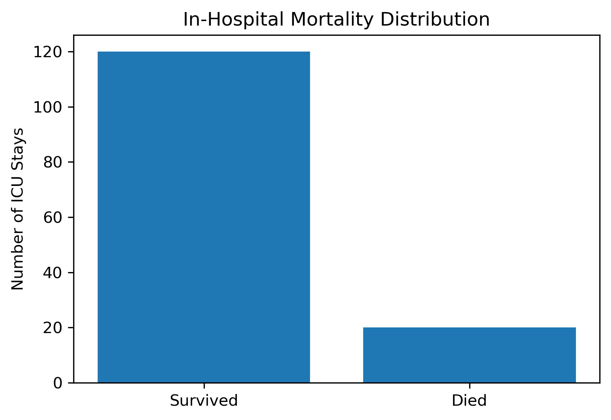
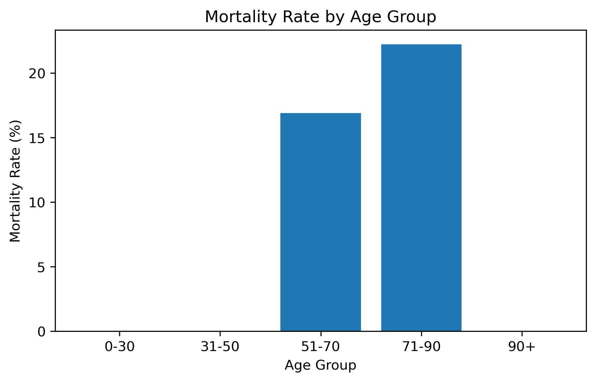
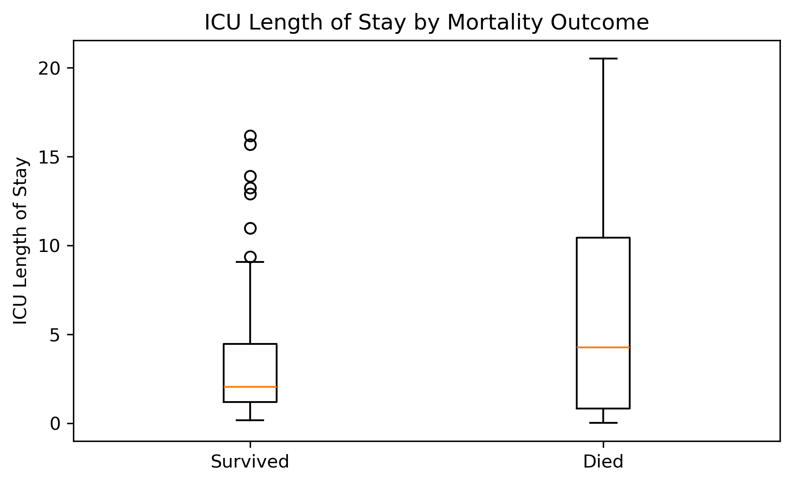
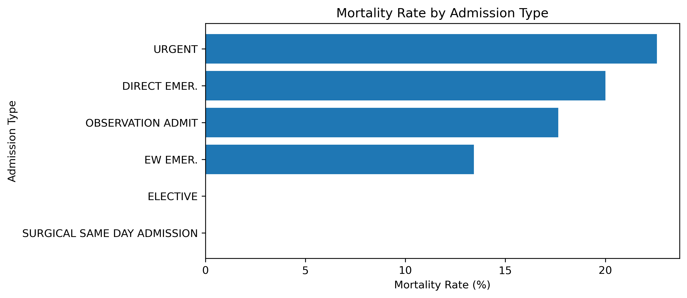
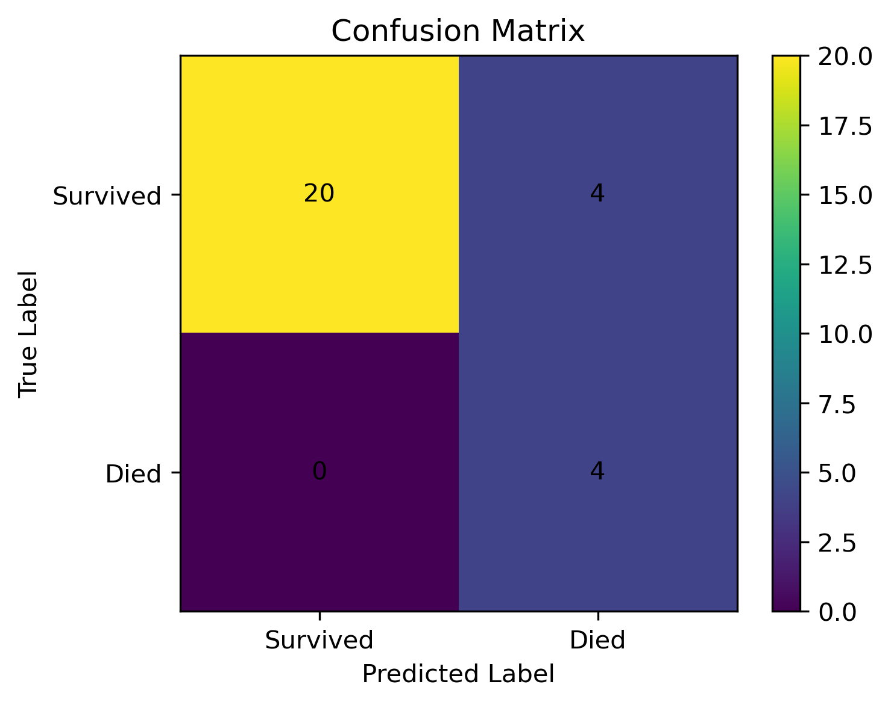
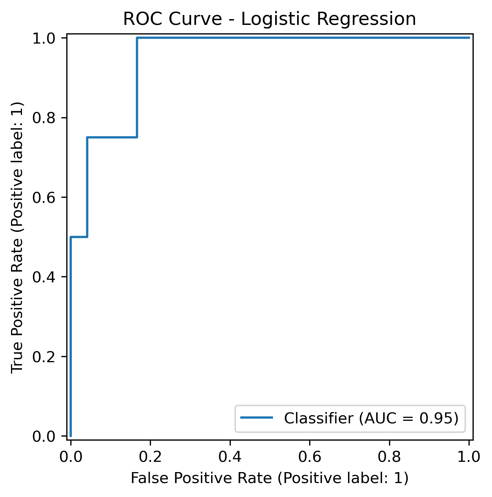
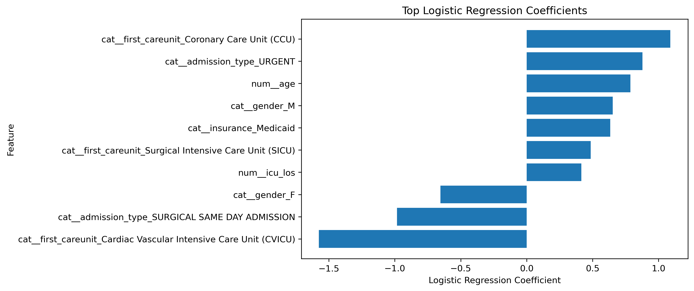

# ICU Mortality Risk Modeling Using MIMIC-IV Demo

Focus: Healthcare Analytics, ICU Patient Risk, Clinical Data Modeling

## Overview

This project builds a prototype ICU mortality risk modeling pipeline using the MIMIC-IV Clinical Database Demo.

The goal is to create an ICU stay-level dataset by combining patient, hospital admission, and ICU stay records. The project then explores basic mortality patterns and builds a baseline Logistic Regression model to predict in-hospital mortality risk.

This project is designed to demonstrate how clinical data can be cleaned, merged, explored, modeled, and interpreted in a responsible way.

## Project Question

Can basic ICU patient information be used to identify patients with higher in-hospital mortality risk?

Additional questions:

- How does mortality risk differ by age group?
- How does ICU length of stay relate to mortality outcome?
- Do certain admission types show higher mortality rates?
- Can a baseline Logistic Regression model identify higher-risk ICU patients?
- Which patient or ICU stay-level features are most associated with predicted mortality risk?

## Data Source

This project uses the MIMIC-IV Clinical Database Demo from PhysioNet.

MIMIC-IV contains deidentified electronic health record data from hospital and ICU patients. This project uses the demo version for learning and portfolio purposes.

Main tables used:

- patients: patient demographic information
- admissions: hospital admission information and mortality outcome
- icustays: ICU stay information

The target variable is:

- hospital_expire_flag

Target meaning:

- 0: patient did not die during the hospital admission
- 1: patient died during the hospital admission

Raw MIMIC-IV Demo data is not included in this repository. This repository includes code, documentation, and visualizations only.

## Project Structure

```text
icu-patient-risk-modeling/
├── README.md
├── requirements.txt
├── .gitignore
├── notebooks/
│   └── icu-patient-risk-modeling.ipynb
├── data/
│   └── README.md
└── visuals/
    ├── mortality_distribution.png
    ├── mortality_by_age_group.png
    ├── icu_los_by_mortality.png
    ├── mortality_by_admission_type.png
    ├── confusion_matrix.png
    ├── roc_curve.png
    └── logistic_regression_coefficients.png
```

## Methodology

The project creates an ICU stay-level dataset by merging patient, admission, and ICU stay records.

The final Version 1 dataset uses the following features:

- age
- icu_los
- gender
- admission_type
- insurance
- first_careunit

The target variable is hospital_expire_flag.

The project workflow includes:

1. Loading MIMIC-IV Demo tables
2. Selecting relevant columns
3. Merging patient, admission, and ICU stay records
4. Creating an ICU stay-level modeling dataset
5. Performing exploratory data analysis
6. Training a baseline Logistic Regression model
7. Evaluating model performance
8. Interpreting model coefficients

Because the dataset has fewer mortality cases than survival cases, the baseline model uses class_weight="balanced".

This helps the model pay more attention to the minority class, which is the mortality group.

## Visualizations

### Mortality Distribution

This chart shows the distribution of survival and mortality cases in the ICU stay-level dataset.



### Mortality by Age Group

This chart compares in-hospital mortality rates across patient age groups.



### ICU Length of Stay by Mortality Outcome

This chart compares ICU length of stay between patients who survived and patients who died during the hospital admission.



### Mortality by Admission Type

This chart compares mortality rates across different hospital admission types.



### Confusion Matrix

This chart shows how the baseline Logistic Regression model classified survival and mortality cases in the test set.



### ROC Curve

This chart shows the model's ability to separate survival and mortality cases across different classification thresholds.



### Logistic Regression Coefficients

This chart shows which features had the strongest association with the model's predicted mortality risk.



## Key Findings

- Built a clean ICU stay-level dataset by merging patient, admission, and ICU stay records from MIMIC-IV Demo.
- The final dataset contained 140 ICU stays, with mortality cases representing about 14.29% of the sample.
- Mortality risk was higher among older patient groups and patients with longer ICU stays in this demo dataset.
- A baseline Logistic Regression model with class_weight="balanced" achieved 0.86 accuracy and 0.948 ROC-AUC on the test set.
- The model identified all mortality cases in the test set, but also produced some false positives, showing a common healthcare modeling trade-off.

This project should be viewed as a prototype ICU risk modeling pipeline, not a clinical decision-making tool.

## Model Interpretation

The Logistic Regression coefficient analysis helped identify which features were most associated with predicted mortality risk.

In this baseline model:

- Higher age was associated with higher predicted mortality risk.
- Higher icu_los was associated with higher predicted mortality risk.
- Some admission type and ICU care unit categories appeared as important model signals.
- URGENT admission had a positive coefficient, meaning it was associated with higher predicted mortality risk in this model.
- SURGICAL SAME DAY ADMISSION had a negative coefficient, meaning it was associated with lower predicted mortality risk in this model.

These results should be interpreted as model signals, not direct clinical conclusions.

## Limitations

This project uses the MIMIC-IV Demo dataset, which contains a small subset of patients. Because of the small sample size, model performance should be interpreted carefully.

The test set contained only 28 ICU stays, including 4 mortality cases. This means evaluation metrics such as recall, precision, and ROC-AUC may change substantially with a larger dataset.

This version uses only basic demographic, admission, and ICU stay-level features. It does not yet include:

- Lab results
- Vital signs
- Diagnoses
- Medications
- First 24-hour clinical features

Because this model uses limited features, it should be viewed as a baseline prototype rather than a complete clinical risk model.

This project should not be interpreted as clinical evidence or used for medical decision-making.

## Data Privacy and Responsible Use

Raw MIMIC-IV Demo data is not included in this repository.

Processed patient-level files are also excluded from this repository to follow responsible healthcare data handling practices.

The repository is designed to show the analysis workflow, visualizations, and modeling approach without redistributing clinical data.

## Data Leakage Note

This Version 1 model uses only demographic, admission, and ICU stay-level summary features.

Future versions should carefully limit lab results and vital signs to information available within the first 24 hours of ICU admission.

Using information recorded after the prediction window could create data leakage, making model performance look better than it would in real clinical use.

Preventing data leakage is especially important in healthcare risk modeling because feature timing affects whether a model is realistic.

## Future Improvements

Future versions of this project could include:

- Lab results from labevents
- Vital signs from chartevents
- First 24-hour clinical feature engineering
- Diagnosis-based comorbidity features
- Medication and procedure features
- Random Forest or Gradient Boosting models
- SHAP-based model interpretation
- More robust validation using the full MIMIC-IV dataset after completing credentialed access requirements

The next major improvement would be adding first-24-hour labs and vital signs while carefully avoiding data leakage.

## How to Run

1. Clone this repository.

```bash
git clone https://github.com/Dongwoon1d/icu-patient-risk-modeling.git

cd icu-patient-risk-modeling
```

2. Install the required packages.

```bash
pip install -r requirements.txt
```

3. Download the MIMIC-IV Clinical Database Demo from PhysioNet.

Place the downloaded dataset in the following local path:

```text
data/mimic-iv-clinical-database-demo/
```

4. Open the notebook in Jupyter Notebook or JupyterLab.

```text
notebooks/icu-patient-risk-modeling.ipynb
```

5. Run all cells in the notebook.

The notebook will create the ICU stay-level dataset, generate visualizations, train a baseline Logistic Regression model, evaluate the model, and save local processed outputs.

## Tools Used

- Python
- Pandas
- NumPy
- Matplotlib
- Scikit-learn
- JupyterLab
- MIMIC-IV Clinical Database Demo
